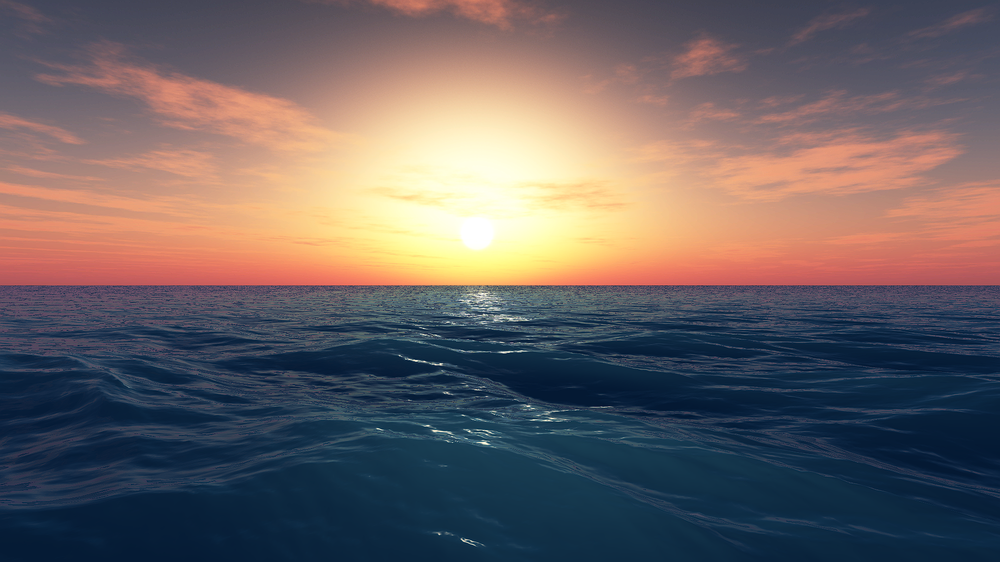

# Ocean-Rendering
 
## 波形
- 正弦波
- Gerstner波
- 基于FFT的波形

## 渲染
- Blinn-Phong光照渲染
- Fresnel效果
- Fast Approximating 次表面散射方案
- 基于雅可比行列式的白沫效果

## Result

## Reference
[1] [Simulating Ocean Water](https://www.researchgate.net/publication/264839743_Simulating_Ocean_Water) 
[2] [真实感水体渲染技术总结](https://zhuanlan.zhihu.com/p/95917609) 
[3] [FFT海面模拟](https://zhuanlan.zhihu.com/p/64414956) 
[4] [FFT海洋学习笔记](https://zhuanlan.zhihu.com/p/335045713) 
[5] [【学习笔记】Unity 基于GPU FFT海洋的实现-实践篇](https://zhuanlan.zhihu.com/p/96811613) 
[6] [【学习笔记】Unity 基于GPU FFT海洋的实现-理论篇](https://zhuanlan.zhihu.com/p/95482541) 
[6] [FFT-Ocean](https://github.com/gasgiant/FFT-Ocean) 
[7] [Phillips-Ocean](https://github.com/Scrawk/Phillips-Ocean) 
[8] [FFTOcean](https://github.com/Straw1997/FFTOcean) 
